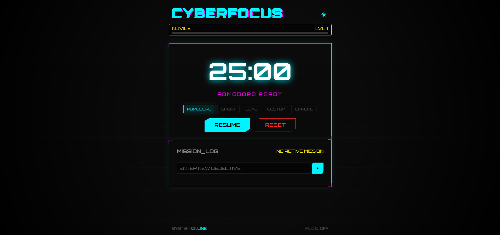
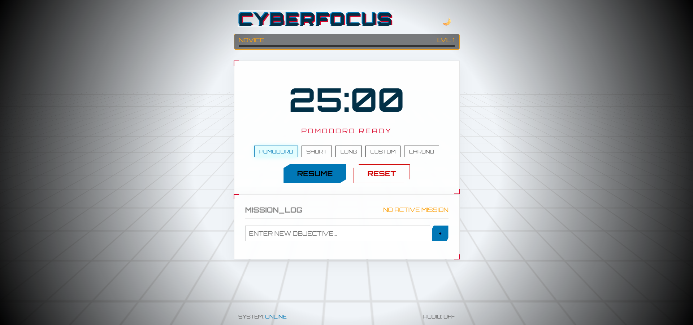

# 🌃 CYBERFOCUS

Odaklanmayı oyunlaştıran bir Pomodoro uygulaması. Saf **HTML, CSS ve JavaScript** ile yazıldı - framework yok, bağımlılık yok.


## 📸 Önizleme

| **Karanlık Mod** | **Aydınlık Mod** |
|:---:|:---:|
|  |  |


---

## ⚡ Özellikler

### 🎯 Hibrit Zamanlayıcı
- **Pomodoro** (25dk), **Kısa Mola** (5dk), **Uzun Mola** (15dk)
- **Özel Mod**: İstediğin süreyi kendin belirle
- **Kronometre**: Salise hassasiyetinde yukarı sayım

### 📋 Görev Yönetimi
- Basit ve şık görev listesi
- Aktif görev seçimi
- LocalStorage ile kalıcı kayıt (sayfa yenilense bile kaybolmaz)

### 🎮 Seviye Sistemi
- Her tamamlanan Pomodoro için **XP kazan**
- **Novice**'den **Cyberpsycho**'ya kadar seviye atla
- Görsel ilerleme çubuğu

### 🎨 Cyberpunk Tasarım
- Animasyonlu **neon grid** arka plan
- Başlık ve butonlarda **glitch** efektleri
- Cam efektli (glassmorphism) paneller
- **Tema değiştirici**: Karanlık ↔ Aydınlık mod

### 🔊 Synthwave Ses
- Web Audio API ile kodlanmış alarm sistemi
- Harici ses dosyası gerektirmez

---

## 🚀 Kurulum

### Yerel Kullanım
Repoyu klonla ve `index.html` dosyasını tarayıcında aç:
```bash
git clone https://github.com/mscicek/CyberFocus.git
cd CyberFocus
# index.html'i Chrome/Firefox/Edge ile aç
```
